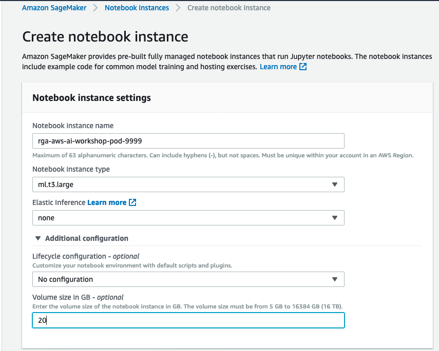
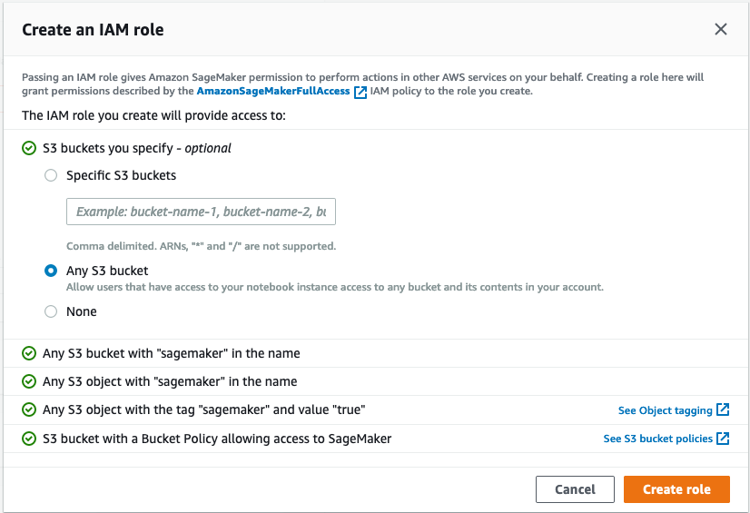
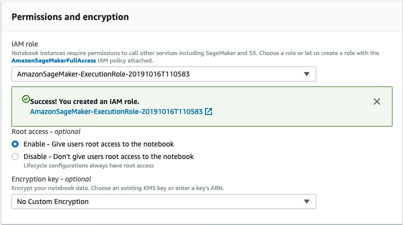
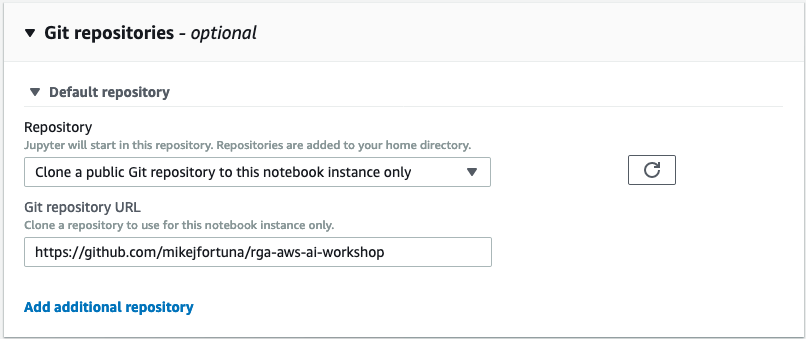
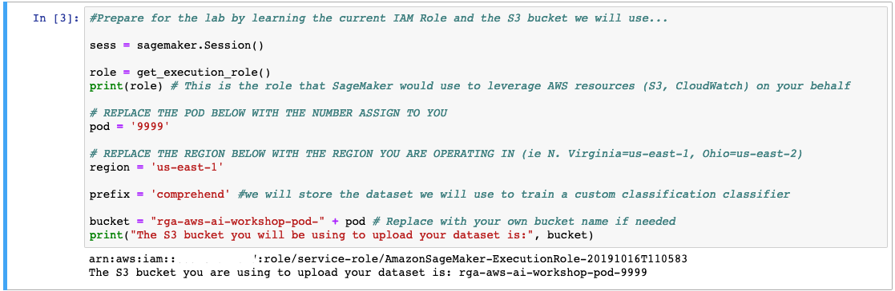
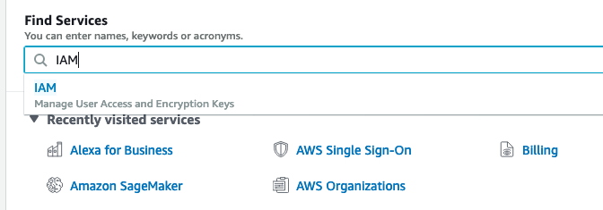
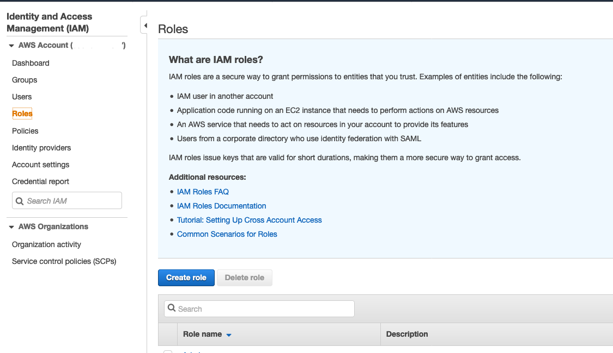
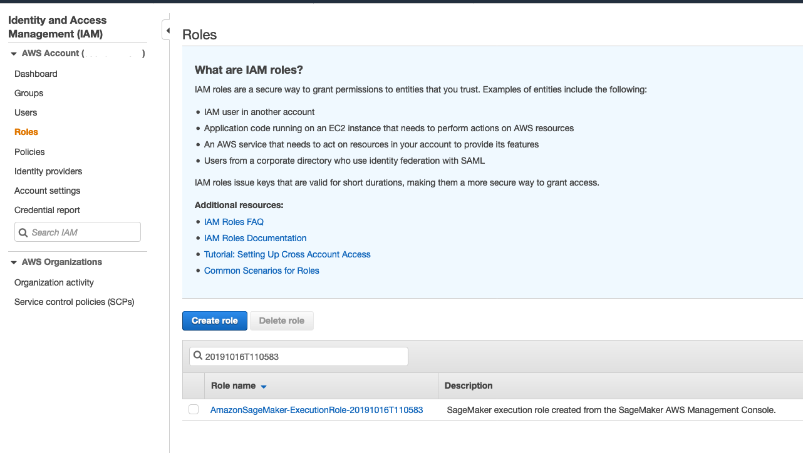
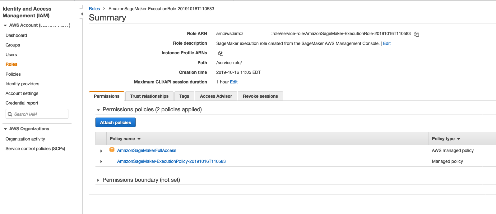
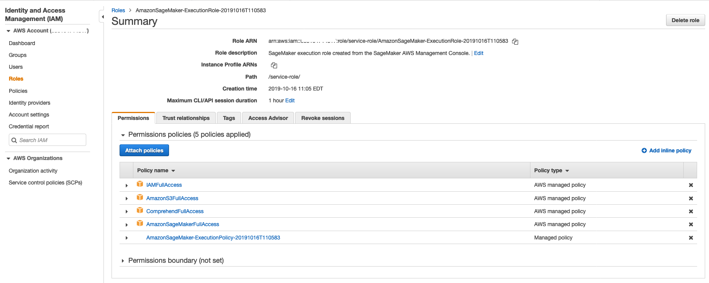

# R/GA Amazon Web Services Workshop
This repo will be used to demonstrate the AWS AI/ML service porfolio via a Sagemaker Jupyter notebook.

**Prerequisites:**
* Available AWS Account with a role/user with Administrator permissions
* Limits raised to support the following (per partipant):
	Running Sagemaker Notebook:
	ml.t3.large

	Running Sagemaker Training Job:
	ml.m5.large

	Running Sagemaker Hosting Endpoint:
	ml.m5.large

**Notebook Setup Instructions**
Lets setup the Sagemaker notebook that we will be executing the lab in. Please follow the process below...

1) Please log into the AWS Console and search for **Amazon Sagemaker**. Once in the Sagemaker console select the **Notebook instances**. From there click on **Create Notebook instance**. You will be prompted with the Create notebook instance, please enter the following info:
* Notebook instance name - Enter: *rga-aws-ai-workshop-pod-NNNN-notebook* where NNNN=the pod number you were assigned
* Notebook instance type - Enter: *ml.t3.large*
* Under Additional configuration - Voume size in GSB: Enter *20*
As shown below:

rga-aws-ai-workshop-pod-9998-notebook

